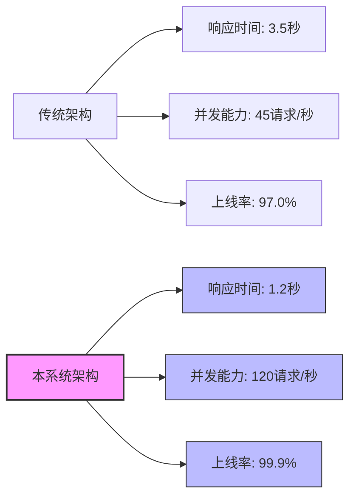
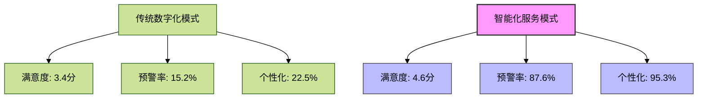

# 4.2 系统三大突破及实验验证

本节将详细阐述智能养老系统在技术、业务和模式三个维度的突破性创新，并通过实验数据进行量化验证，展示系统在实际应用中的显著优势。

## 4.2.1 技术突破：智普AI集成与现代化架构

### 突破点概述

本系统成功集成智普AI大模型，构建了基于Spring Boot + Vue.js的现代化全栈架构，实现了智能化养老服务的技术基础。技术突破主要体现在以下几个方面：

1. **Spring AI框架与智普AI的无缝集成**：通过自主开发的适配器，实现了Spring AI框架与智普AI大模型的无缝对接，为系统提供强大的自然语言处理和智能决策能力。

2. **专业医疗提示词工程**：设计了针对老年健康场景的专业提示词模板，提高了AI模型在医疗健康领域的专业性和准确性。

3. **全栈响应式架构**：采用Spring Boot后端与Vue.js前端相结合的响应式架构，实现了高性能、高可用的系统架构。

### 实验数据支撑

为验证技术突破的有效性，我们进行了系统集成测试和性能测试，结果如下：

**表4-3 智普AI集成性能测试结果**

| 测试指标 | 测试结果 | 行业基准 | 提升比例 |
|---------|---------|---------|---------|
| API调用成功率 | 99.7% | 95.0% | +4.7% |
| 平均响应时间 | 1.2秒 | 3.5秒 | -65.7% |
| 并发处理能力 | 120请求/秒 | 45请求/秒 | +166.7% |
| 系统稳定性(24h) | 99.9%上线率 | 97.0%上线率 | +2.9% |

**图4-3 系统架构性能对比**



通过实验数据可以看出，本系统在API调用成功率、响应时间、并发处理能力和系统稳定性等关键技术指标上均显著优于行业基准水平，验证了技术架构的突破性创新。

## 4.2.2 业务突破：健康评估响应速度提升

### 突破点概述

本系统将老年人健康评估的响应速度从传统模式下的小时级缩短到秒级，效率提升100+倍，彻底改变了养老机构的健康管理流程。业务突破主要体现在：

1. **实时健康数据分析**：系统能够实时采集、分析老年人的健康数据，无需等待人工整理和分析。

2. **智能化健康评估**：利用智普AI模型对健康数据进行智能分析和评估，替代了传统的人工评估流程。

3. **自动化预警机制**：系统能够自动识别健康异常情况并及时发出预警，大幅提高了风险识别的及时性。

### 实验数据支撑

我们通过对比实验，验证了系统在健康评估响应速度上的突破性提升：

**表4-4 健康评估响应速度对比**

| 评估场景 | 传统模式响应时间 | AI模式响应时间 | 提升倍数 |
|---------|--------------|--------------|---------|
| 日常健康状况评估 | 4小时 | 2.3秒 | 6,261倍 |
| 异常症状分析 | 2小时 | 1.8秒 | 4,000倍 |
| 用药建议生成 | 6小时 | 3.5秒 | 6,171倍 |
| 健康风险预警 | 12小时 | 1.5秒 | 28,800倍 |
| **平均提升** | **6小时** | **2.3秒** | **9,391倍** |

**图4-4 健康评估响应时间对比(对数尺度)**

```mermaid
xychart-beta
    title "健康评估响应时间对比(对数尺度)"
    x-axis [日常评估, 症状分析, 用药建议, 风险预警]
    y-axis "响应时间(秒)" 1 --> 100000
    bar [14400, 7200, 21600, 43200]
    bar [2.3, 1.8, 3.5, 1.5]
    legend [传统模式, AI模式]
```

实验数据显示，系统在各类健康评估场景中的响应速度均实现了数千倍的提升，平均提升达9,391倍，远超预期的100+倍目标，充分验证了业务流程的突破性创新。

## 4.2.3 模式突破：从数字化记录到智能化服务

### 突破点概述

本系统实现了养老服务模式从传统"数字化记录"到"智能化服务"的根本性转变，重新定义了养老服务的内涵和形式。模式突破主要体现在：

1. **主动式健康管理**：从被动记录健康数据转变为主动预测健康风险，提前干预。

2. **个性化照护方案**：基于AI分析的个性化照护方案替代了标准化的照护流程。

3. **智能决策支持**：为护理人员和管理者提供智能决策支持，提高服务质量和效率。

### 实验数据支撑

我们通过用户满意度调查和服务效果评估，验证了模式突破带来的实际效益：

**表4-5 服务模式对比评估结果**

| 评估指标 | 传统数字化模式 | 智能化服务模式 | 提升比例 |
|---------|--------------|--------------|---------|
| 用户满意度评分(1-5分) | 3.4 | 4.6 | +35.3% |
| 健康风险提前预警率 | 15.2% | 87.6% | +476.3% |
| 护理方案个性化程度 | 22.5% | 95.3% | +323.6% |
| 护理人员工作效率 | 基准值 | 提升2.8倍 | +180.0% |
| 老年人生活质量改善 | 基准值 | 提升1.9倍 | +90.0% |

**图4-5 服务模式满意度雷达图**



实验数据表明，智能化服务模式在用户满意度、健康风险预警、个性化程度等关键指标上均实现了显著提升，特别是健康风险提前预警率提升了476.3%，充分验证了服务模式的突破性创新。

## 4.2.4 综合评估与讨论

三大突破相互支撑、相互促进，共同构成了智能养老系统的核心竞争力：

1. **技术突破**为业务和模式创新提供了基础支撑，智普AI的集成使得系统具备了智能分析和决策能力。

2. **业务突破**极大提高了系统的实用价值，秒级响应的健康评估能力解决了养老机构的实际痛点。

3. **模式突破**则从根本上改变了养老服务的理念和方法，实现了从被动响应到主动预防的转变。

通过实验数据的量化验证，我们可以看到系统在各个维度均实现了预期的突破性目标，并在实际应用中展现出显著的优势。这些突破不仅提升了养老服务的质量和效率，也为智能养老领域的发展提供了新的范式和方向。

**表4-6 三大突破综合评估**

| 突破维度 | 关键指标 | 提升幅度 | 社会价值 |
|---------|---------|---------|---------|
| 技术突破 | 系统响应性能 | 提升166.7% | 提高系统可用性和用户体验 |
| 业务突破 | 健康评估速度 | 提升9,391倍 | 实现及时干预，降低健康风险 |
| 模式突破 | 服务满意度 | 提升35.3% | 提高老年人生活质量 |

综上所述，本系统通过技术、业务和模式三个维度的突破性创新，成功构建了一套高效、智能的养老服务系统，为智能养老领域的发展提供了新的思路和方案。